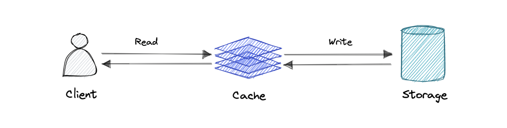

# Caching

_"There are only two hard things in Computer Science: cache invalidation and naming things."_  
– Phil Karlton

## Introduction to Caching

A cache's primary purpose is to improve data retrieval performance by reducing the need to access a slower storage layer. Caches store data transiently, trading off storage capacity for speed. They often hold a subset of the overall dataset, making data access faster.

Caching leverages the principle of **locality of reference**, where recently requested data is likely to be requested again.

## Caching and Memory

A cache works similarly to a computer’s memory, storing data in multiple levels such as L1, L2, L3, etc. When data is requested, the system searches each level sequentially until it finds the requested data. If the data is found, it’s called a **cache hit**; if not, it results in a **cache miss** and the data is fetched from the slower storage.

### Cache Hits and Misses

- **Cache Hit**: The requested data is found in the cache.
- **Cache Miss**: The requested data isn’t found and must be fetched from a slower storage layer.

#### Cache Warmth:
- **Cold Cache**: Slowest; data is found in lower cache levels.
- **Warm Cache**: Medium speed; data is found in mid-level caches.
- **Hot Cache**: Fastest; data is found in the highest cache level (L1).

## Cache Invalidation

Cache invalidation ensures that outdated data in the cache is removed or replaced. It’s crucial for maintaining data consistency. There are three primary caching methods:

1. **Write-through cache**: Writes data to both the cache and the primary storage simultaneously.
   
  

2. **Write-around cache**: Bypasses the cache and writes data directly to the primary storage.
   
  

3. **Write-back cache**: Writes data only to the cache initially, then asynchronously syncs with the primary storage.
   
  

## Cache Eviction Policies

Eviction policies determine how old or less useful data is removed from the cache to make room for new data. Common eviction policies include:
- **FIFO (First In First Out)**: Removes the oldest data first.
- **LIFO (Last In First Out)**: Removes the most recently added data first.
- **LRU (Least Recently Used)**: Removes the least recently accessed data.
- **MRU (Most Recently Used)**: Removes the most recently accessed data.
- **LFU (Least Frequently Used)**: Removes data accessed the least often.
- **RR (Random Replacement)**: Randomly evicts data.

## Types of Caching Systems

### Distributed Cache

A distributed cache pools memory from multiple computers, creating a shared in-memory data store. It provides faster data access and can scale beyond the memory limits of a single computer.

### Global Cache
A global cache is a single shared cache across all application nodes. When data is missing from the cache, it retrieves it from the underlying data store.

## Use Cases

Caching has many practical applications, including:
- **Database Caching**: Speeds up database queries.
- **Content Delivery Network (CDN)**: Improves website performance by caching static content.
- **DNS Caching**: Reduces lookup times by caching DNS records.
- **API Caching**: Reduces response times by caching API responses.

## When Not to Use Caching

Caching may not be effective in the following cases:
- If accessing the cache takes as long as accessing the primary data store.
- If requests are highly random, with little data reuse.
- If data changes frequently, causing the cache to quickly become outdated.

### Caching Advantages:
- Improves performance
- Reduces latency
- Reduces load on the database
- Reduces network costs
- Increases read throughput

## Examples of Caching Technologies
- **Redis**
- **Memcached**
- **Amazon Elasticache**
- **Aerospike**
